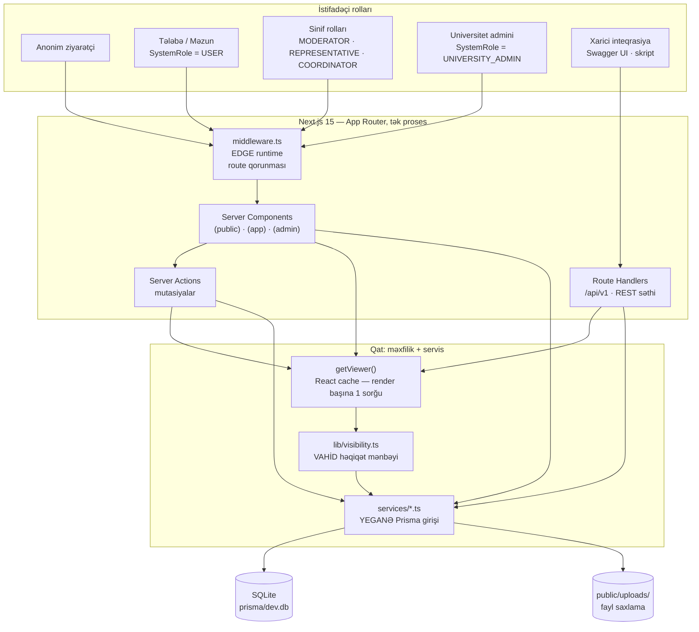
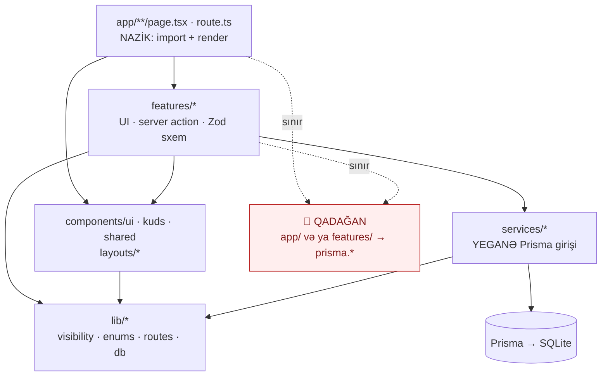
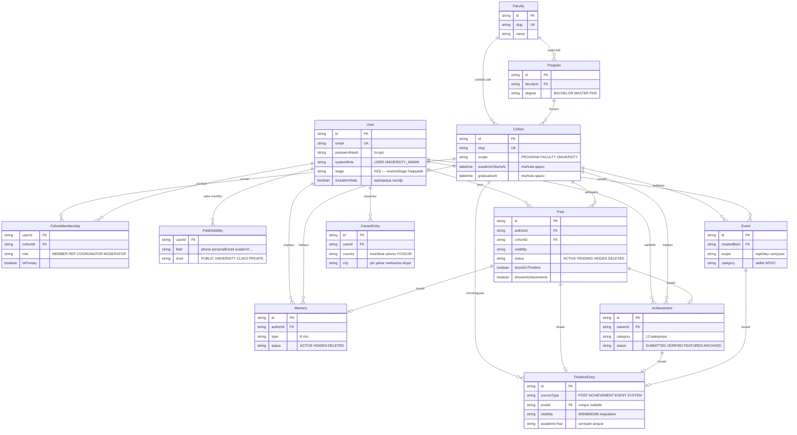
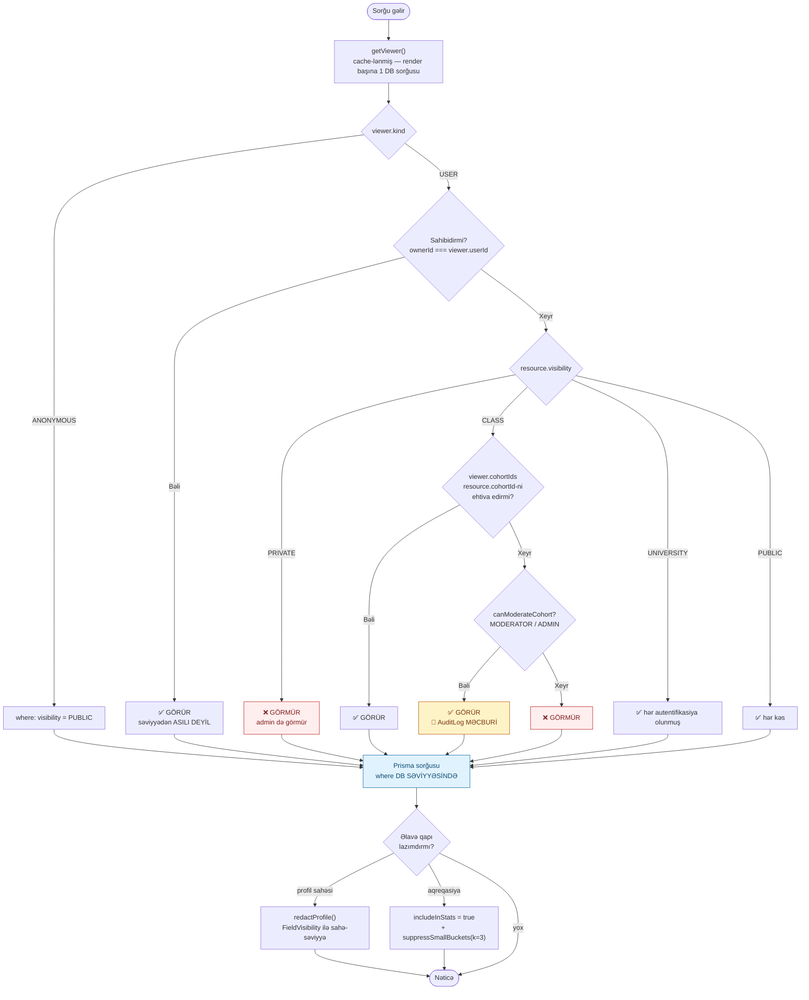
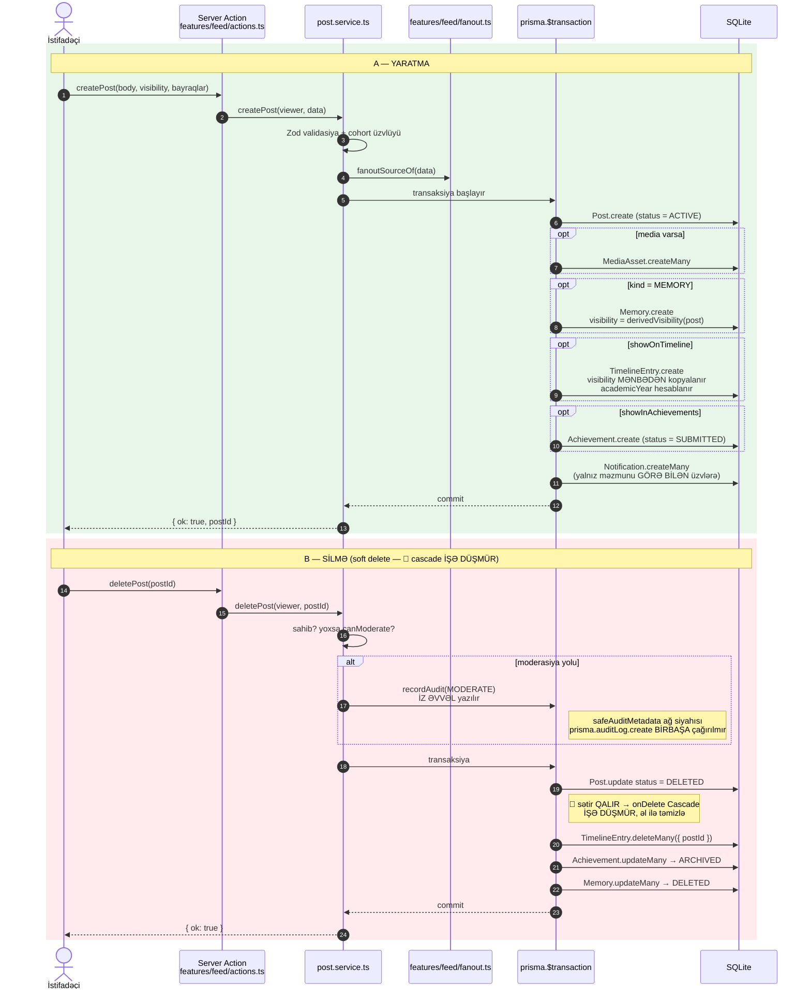
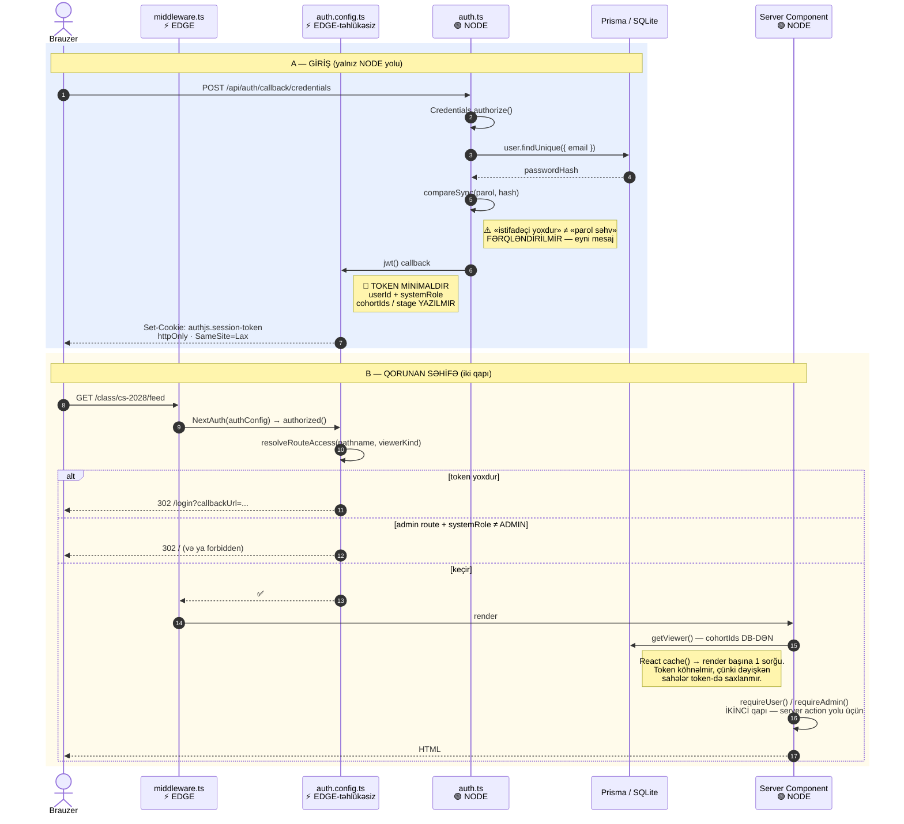
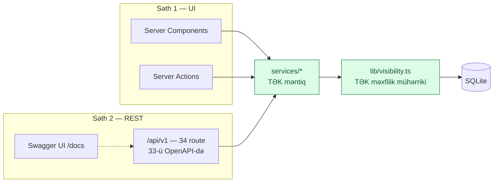

# QU CLASS — Arxitektura

> Bu sənəd sistemin **quruluşunu** izah edir: qatlar, data modeli, məxfilik
> qərar axını və auth. «Niyə belə?» sualının cavabı ayrı fayldadır —
> [`DECISIONS.md`](DECISIONS.md). Təhlükə modeli — [`SECURITY.md`](SECURITY.md).
>
> Diaqramlar Mermaid-dir və GitHub-da birbaşa render olunur.

**Ölçülmüş miqyas** (`2026-07-31`):

| | |
|---|---|
| Prisma modeli | **28** (miqrasiya: 3) |
| Səhifə (`page.tsx`) | **51** |
| Xüsusiyyət modulu (`src/features/*`) | **24** |
| Servis faylı (`src/services/*`) | **23** |
| REST endpoint (`/api/v1`) | **34** route · **33**-ü OpenAPI-də sənədləşib |
| Vahid + inteqrasiya testi | **1510** (61 fayl) |
| E2E testi | **213** (21 fayl) |
| TypeScript mənbə faylı | **512** (~69 000 sətir, testlərsiz) |

---

## 1. Sistem konteksti

Ayrı backend serveri **yoxdur**. Next.js həm render, həm API qatıdır; hər ikisi
eyni servis qatını çağırır.



**Oxunacaq qayda:** `page.tsx` və route handler **heç vaxt** `prisma.*`
çağırmır. Hər servis funksiyası ilk arqument kimi `Viewer` alır və sorğuya
`visibilityWhere(viewer)` birləşdirir.

---

## 2. Qovluq strukturu və qat qaydaları

```
src/
  middleware.ts     Edge — route qorunması (YALNIZ auth.config)
  auth.config.ts    Auth.js — Edge-təhlükəsiz hissə
  auth.ts           Auth.js — Node hissəsi (Credentials + Prisma + bcrypt)
  app/              route ağacı — page.tsx faylları NAZİKDİR
    (public)/ (app)/ (admin)/ api/
  layouts/          PublicShell · AppShell · AdminShell · naviqasiya
  features/         24 modul — UI + server action-lar
  components/
    ui/             shadcn primitivləri — TOXUNULMAZ
    kuds/           KUDS wrapper-ləri
    shared/         StatCard · EmptyState · VisibilityBadge · PostCard...
  services/         23 fayl — BÜTÜN Prisma sorğuları
  lib/              visibility.ts · enums.ts · routes.ts · db.ts · auth.ts...
  hooks/ types/ utils/ styles/ assets/
```

Qat qaydası — ox **yalnız aşağı** göstərir:



| Qat | Nə edə bilər | Nə edə BİLMƏZ |
|---|---|---|
| `app/**` | `features/*`-dan import edib render etmək | `prisma.*`, biznes məntiqi |
| `features/*` | `services/*` və `lib/*` çağırmaq, UI qurmaq | `prisma.*` birbaşa |
| `components/ui/*` | heç nə — shadcn mənbəyidir | redaktə olunmaq, dublikat |
| `components/kuds`, `shared` | `lib/*` işlətmək | `services/*` çağırmaq |
| `services/*` | `prisma.*`, `lib/visibility` | React / UI import etmək |
| `lib/*` | saf funksiyalar, `db.ts` | `services/*`-dan asılı olmaq |

⚠️ **`src/pages/` YARADILMIR.** Next.js bunu köhnə Pages Router kimi qəbul edir.
KUDS §20-dəki `pages/` bizdə `src/features/`-dir — bax [`DECISIONS.md`](DECISIONS.md) → QD-004.

---

## 3. Data modeli — əsas 12 model

28 modelin hamısı deyil; diaqram **oxunaqlı** qalsın deyə nüvə seçilib.
Kənarda qalanlar: `Tag` `UserTag` `MediaAsset` `Comment` `Reaction`
`EducationEntry` `SupportOffer` `Club` `ClubMembership` `EventRSVP`
`Notification` `Report` `AuditLog` `ContentPage` `Faq` `GuidePlace`.
Tam sxem: [`prisma/schema.prisma`](../prisma/schema.prisma).



⚠️ **`CareerEntry`-də `salary` / `bonus` / `latitude` / `longitude` sütunu
QƏSDƏN yoxdur** — səbəb [`DECISIONS.md`](DECISIONS.md) → QD-011, QD-012.

---

## 4. Məxfilik qərar axını

Sistemin ürəyi. İki ayrı yol var və **hər ikisi eyni qaydanı** tətbiq edir:

- `canView(viewer, resource)` — **tək obyekt** üçün bool (səhifə sərhədi).
- `visibilityWhere(viewer)` — **siyahı** üçün Prisma `where` fraqmenti.



🔴 **Filtr DB-dədir, JS-də deyil.** JS-də filtrləmə iki şeyi sındırır:
`take`/`skip` səhifələmə saymağı (istifadəçi «boş səhifə» görür) və
`count()` aqreqasiyası (say sızır). Bax [`DECISIONS.md`](DECISIONS.md) → QD-006.

**Status ölçüsü ayrıdır** — və modeldən modelə fərqlidir:

| Model | Aktiv statuslar | İşlədiləcək köməkçi |
|---|---|---|
| `Post`, `Memory` | `ACTIVE` | `activeVisibleWhere(viewer)` |
| `Achievement` | `VERIFIED`, `FEATURED` | `visibleWithStatus(viewer, [...])` |
| `Event` | `PUBLISHED`, `COMPLETED` | `visibleWithStatus(viewer, [...])` |
| `TimelineEntry` | — (status sütunu yoxdur) | `timelineVisibilityWhere(viewer)` |

⚠️ `Achievement`/`Event` üçün `activeVisibleWhere` çağırsan **sıfır nəticə**
alırsan — `"ACTIVE"` o cədvəllərdə mövcud status deyil.

---

## 5. Feed → Timeline → Achievement fan-out

Bir paylaşım üç səthdə görünə bilər. Üçü də **tək transaksiyada** yaranır.



**Görünürlük tavanı.** `TimelineEntry.visibility` mənbədən kopyalanır və ondan
**daha açıq ola bilməz**. Əlavə tavan varsa `narrowest(postVisibility, ceiling)`
işlədilir. `academicYear` sentyabr 1 – avqust 31 aralığı ilə hesablanır:
`2026-11-05` → `"2026-2027"`.

---

## 6. Auth axını — Edge / Node bölgüsü

Auth.js konfiqi **ikiyə bölünüb**, çünki `middleware.ts` Edge runtime-dadır və
onun import qrafındakı hər modul Edge üçün bundle olunur. Prisma engine və
`bcryptjs` orada işləmir → birləşdirilsə `npm run build` sınır.



| Fayl | Runtime | Nə var | Nə YOXDUR |
|---|---|---|---|
| `auth.config.ts` | Edge | `callbacks` (`authorized`, `jwt`, `session`), kuka adı, `providers: []` | Prisma, bcrypt |
| `auth.ts` | Node | `auth.config` spread + `Credentials` provider + `signIn` callback | — |
| `middleware.ts` | Edge | `NextAuth(authConfig)` — **yalnız** | `auth.ts` importu |
| `lib/auth.ts` | Node | barrel: `auth`, `getViewer`, `requireUser`, `requireAdmin`, `requireCohortRole` | — |

⚠️ **Middleware yeganə qapı deyil.** Server action-lar middleware matcher-indən
keçməyə bilər, ona görə `requireUser()` / `requireAdmin()` səhifə səviyyəsində
eyni yoxlamanı təkrarlayır. Qorunan URL prefiksləri `src/lib/routes.ts`-dədir —
route qrupu (`(app)`) URL-də görünmür, middleware qrup adına baxa bilməz.

---

## 7. İki API səthi — niyə dublikat deyil



`/api/v1` **sıfır yeni DB sorğusu** yazır — hamısı mövcud servis funksiyalarını
çağırır. OpenAPI sənədi Zod sxemlərindən **törəyir** (`src/lib/api/openapi.ts`),
yəni əl ilə yazılmış YAML köhnələ bilmir.

⚠️ v1 qatı bir yerdə UI-dan **daha məhduddur**: üzv olmadığın sinif üçün
endpoint `404` qaytarır (`src/lib/api/cohort-scope.ts`), səhifə isə boş siyahı
göstərir. `403` yerinə `404` — resursun **mövcudluğu** da məlumatdır.

## 8. Sənədə salınmayan daxili route-lar

`src/app/api` altında `/api/v1`-dən kənar 6 route var. İkisi (`/api/upload`,
`.../ics`) **ictimai müqavilədir** və OpenAPI sənədinə salınıb (`Media` /
`Events` taqları, `src/lib/api/openapi.ts`). Qalan dördü **daxili UI
detalıdır** — sənədə salınmır, çünki xarici müştəri onları HEÇ VAXT çağırmır
(brauzer naviqasiyası və ya UI-ın öz `fetch` kontraktı):

| Route | Niyə sənəddə yox |
|---|---|
| `/api/feed` | `FeedList` → `useInfiniteQuery` üçün UI müqaviləsidir; sənədlənmiş qarşılığı `/api/v1/cohorts/{slug}/posts`-dur (TƏLƏ F — bax `src/app/api/v1/cohorts/[slug]/posts/route.ts`). |
| `/api/search` | ⌘K palitrasının UI müqaviləsidir; sənədlənmiş qarşılığı `/api/v1/search`-dır (TƏLƏ F — bax `src/app/api/v1/search/route.ts`). |
| `/api/session/expired` | Auth.js yönləndirmə dövrəsini kəsən daxili qaçış yoludur — brauzer `Location` naviqasiyası ilə çağırılır, JSON müştərisi yoxdur, `redirect()` server komponentindən yazıla bilmədiyi üçün route handler kimi mövcuddur. |
| `/api/auth/[...nextauth]` | Auth.js v5-in ÖZ protokoludur (`handlers`-dən birbaşa) — bizim müqavilə deyil, kitabxananın daxili sorğu-cavab formatını daşıyır. |

⚠️ Bu, boşluğu **örtmək** deyil, **qərarı sənədləşdirməkdir**: müdafiədə
«niyə sənəddə deyil?» sualının cavabı budur. Ağ siyahı kod səviyyəsində
`src/lib/api/openapi.test.ts` → `UNDOCUMENTED_ROUTE_WHITELIST`-də bərkidilib
— yeni v1-dən kənar route əlavə olunanda test aşır və müəllif ya sənədə
salmalı, ya buraya (və o siyahıya) səbəblə yazmalıdır.

### `/api/upload` — niyə (a)

Fayl yükləmə real xarici müqavilədir: müştəri `multipart/form-data`
göndərir, server ölçü/format doğrulayır və `MediaAsset` sahələrini qaytarır.
Sənəddə (`Media` taqı) ölçü limiti, icazəli MIME tipləri VƏ real status
kodları göstərilir.

🔴 Başlanğıc fərziyyə ölçü aşımının **413** olduğu idi — kodu oxumadan qəbul
edilsəydi sənəd YALAN olardı: route handler (`src/app/api/upload/route.ts`)
`TOO_LARGE`-ı digər doğrulama xətaları ilə eyni statusa, **400**-ə yazır;
yalnız disk yazma xətası (`WRITE_FAILED`) 500 alır.

⚠️ Cavab v1 zərfindən (`{ data }`) keçmir və xəta forması da fərqlidir
(`{ error: "mətn" }`, v1-in `{ error: { code, message } }`-i YOX) —
`src/lib/api/respond.ts` başlığındakı qeyd bunu qəsdən elan edir (TƏLƏ F).
Sessiyasız sorğu da fərqlidir: `requireUser()` səhifə kimi çağırıldığı üçün
JSON 401 yox, **307 → `/login`** qaytarılır.

### `.../events/{id}/ics` — niyə (a)

Təqvim faylı Google Calendar / Outlook kimi xarici alətlərə verilir —
xarici müqavilədir. Sənəddə cavab `text/calendar` kimi (JSON YOX) elan
olunub və `Content-Disposition` / `Cache-Control` başlıqları təsvirdə
izah edilib.
